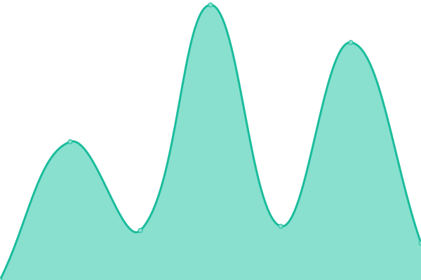
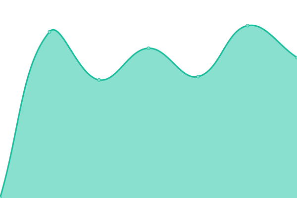
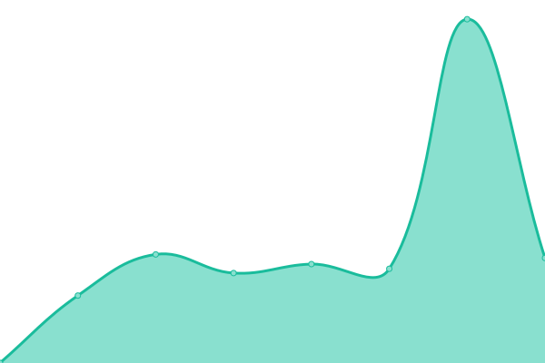
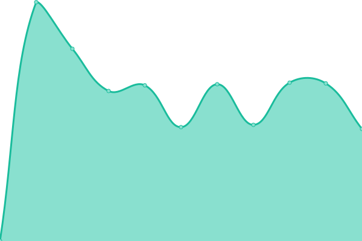
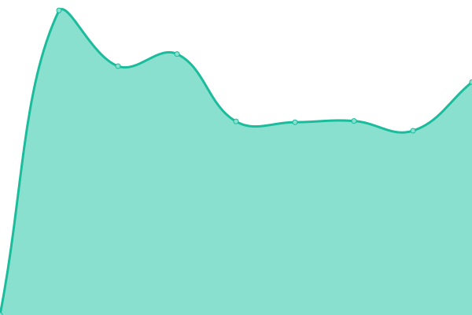

# [📈 Live Status](https://demo.upptime.js.org): <!--live status--> **🟩 All systems operational**

This repository contains the open-source uptime monitor and status page for [ano-pedproject](https://demo.upptime.js.org), powered by [Upptime](https://github.com/upptime/upptime).

With [Upptime](https://upptime.js.org), you can get your own unlimited and free uptime monitor and status page, powered entirely by a GitHub repository. We use [Issues](https://github.com/ano-pedproject/repo/issues) as incident reports, [Actions](https://github.com/ano-pedproject/repo/actions) as uptime monitors, and [Pages](https://demo.upptime.js.org) for the status page.

<!--start: status pages-->
<!-- This summary is generated by Upptime (https://github.com/upptime/upptime) -->
<!-- Do not edit this manually, your changes will be overwritten -->
<!-- prettier-ignore -->
| URL | Status | History | Response Time | Uptime |
| --- | ------ | ------- | ------------- | ------ |
|  [Pedproject.Moscow](https://pedproject.moscow) | 🟩 Up | [pedproject-moscow.yml](https://github.com/ano-pedproject/repo/commits/HEAD/history/pedproject-moscow.yml) | 

 1265ms
     
 | 

<a href="https://ano-pedproject.github.io/repo/history/pedproject-moscow">100.00%</a>
    

|  [Педакадемия.РФ](https://xn--80aakcbevmvw9p.xn--p1ai) | 🟩 Up | [pedakademiya-rf.yml](https://github.com/ano-pedproject/repo/commits/HEAD/history/pedakademiya-rf.yml) | 

 2015ms
     
 | 

<a href="https://ano-pedproject.github.io/repo/history/pedakademiya-rf">98.72%</a>
    

|  [Педпроект.РФ](https://xn--d1abbusdciv.xn--p1ai) | 🟩 Up | [pedproekt-rf.yml](https://github.com/ano-pedproject/repo/commits/HEAD/history/pedproekt-rf.yml) | 

 1277ms
     
 | 

<a href="https://ano-pedproject.github.io/repo/history/pedproekt-rf">98.93%</a>
    

|  [Япедагог.РФ](https://xn--80agabe1dc1k.xn--p1ai) | 🟩 Up | [yapedagog-rf.yml](https://github.com/ano-pedproject/repo/commits/HEAD/history/yapedagog-rf.yml) | 

 1384ms
     
 | 

<a href="https://ano-pedproject.github.io/repo/history/yapedagog-rf">100.00%</a>
    

|  [Педталант.РФ](https://xn--80aakd6ani0ae.xn--p1ai) | 🟩 Up | [pedtalant-rf.yml](https://github.com/ano-pedproject/repo/commits/HEAD/history/pedtalant-rf.yml) | 

 1724ms
     
 | 

<a href="https://ano-pedproject.github.io/repo/history/pedtalant-rf">98.94%</a>
    

|  [Радуга-талантов.РФ](https://xn----7sbabamch1evalo5aeg.xn--p1ai) | 🟩 Up | [raduga-talantov-rf.yml](https://github.com/ano-pedproject/repo/commits/HEAD/history/raduga-talantov-rf.yml) | 

 1160ms
     
 | 

<a href="https://ano-pedproject.github.io/repo/history/raduga-talantov-rf">98.95%</a>
    

|  [Эверест](https://everest-edu.ru) | 🟩 Up | [everest.yml](https://github.com/ano-pedproject/repo/commits/HEAD/history/everest.yml) | 

 1485ms
     
 | 

<a href="https://ano-pedproject.github.io/repo/history/everest">99.11%</a>
    

|  [Конкурсы & Олимпиады](https://konkurs.pedproject.moscow) | 🟩 Up | [konkursy-and-olimpiady.yml](https://github.com/ano-pedproject/repo/commits/HEAD/history/konkursy-and-olimpiady.yml) | 

 1430ms
     
 | 

<a href="https://ano-pedproject.github.io/repo/history/konkursy-and-olimpiady">100.00%</a>
    

|  [Вестник](https://vestnik.pedproject.moscow) | 🟩 Up | [vestnik.yml](https://github.com/ano-pedproject/repo/commits/HEAD/history/vestnik.yml) | 

 1416ms
     
 | 

<a href="https://ano-pedproject.github.io/repo/history/vestnik">100.00%</a>
    

<!--end: status pages-->

[**Visit our status website →**](https://demo.upptime.js.org)

## 📄 License

- Powered by: [Upptime](https://github.com/upptime/upptime)
- Code: [MIT](./LICENSE) © [Anand Chowdhary](https://anandchowdhary.com), supported by [Pabio](https://pabio.com)
- Data in the `./history` directory: [Open Database License](https://opendatacommons.org/licenses/odbl/1-0/)
