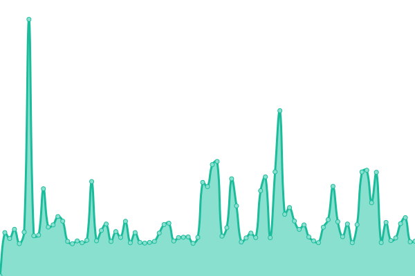

# [📈 Live Status](https://ano-pedproject.github.io/repo): <!--live status--> **🟩 All systems operational**

This repository contains the open-source uptime monitor and status page for [ano-pedproject](https://ano-pedproject.github.io/repo), powered by [Upptime](https://github.com/upptime/upptime).

With [Upptime](https://upptime.js.org), you can get your own unlimited and free uptime monitor and status page, powered entirely by a GitHub repository. We use [Issues](https://github.com/ano-pedproject/repo/issues) as incident reports, [Actions](https://github.com/ano-pedproject/repo/actions) as uptime monitors, and [Pages](https://ano-pedproject.github.io/repo) for the status page.

<!--start: status pages-->
<!-- This summary is generated by Upptime (https://github.com/upptime/upptime) -->
<!-- Do not edit this manually, your changes will be overwritten -->
<!-- prettier-ignore -->
| URL | Status | History | Response Time | Uptime |
| --- | ------ | ------- | ------------- | ------ |
|  [Official](https://pedproject.moscow) | 🟩 Up | [official.yml](https://github.com/ano-pedproject/repo/commits/HEAD/history/official.yml) | 

 1326ms
     
 | 

<a href="https://ano-pedproject.github.io/repo/history/official">100.00%</a>
    

|  [Pedacademy](https://xn--80aakcbevmvw9p.xn--p1ai) | 🟩 Up | [pedacademy.yml](https://github.com/ano-pedproject/repo/commits/HEAD/history/pedacademy.yml) | 

 1210ms
     
 | 

<a href="https://ano-pedproject.github.io/repo/history/pedacademy">87.71%</a>
    

|  [Pedproject](https://xn--d1abbusdciv.xn--p1ai) | 🟩 Up | [pedproject.yml](https://github.com/ano-pedproject/repo/commits/HEAD/history/pedproject.yml) | 

 1292ms
     
 | 

<a href="https://ano-pedproject.github.io/repo/history/pedproject">86.62%</a>
    

|  [Yapedagog](https://xn--80agabe1dc1k.xn--p1ai) | 🟩 Up | [yapedagog.yml](https://github.com/ano-pedproject/repo/commits/HEAD/history/yapedagog.yml) | 

 1585ms
     
 | 

<a href="https://ano-pedproject.github.io/repo/history/yapedagog">100.00%</a>
    

|  [Pedtalant](https://xn--80aakd6ani0ae.xn--p1ai) | 🟩 Up | [pedtalant.yml](https://github.com/ano-pedproject/repo/commits/HEAD/history/pedtalant.yml) | 

 1100ms
     
 | 

<a href="https://ano-pedproject.github.io/repo/history/pedtalant">87.92%</a>
    

|  [Rainbow](https://xn----7sbabamch1evalo5aeg.xn--p1ai) | 🟩 Up | [rainbow.yml](https://github.com/ano-pedproject/repo/commits/HEAD/history/rainbow.yml) | 

 1095ms
     
 | 

<a href="https://ano-pedproject.github.io/repo/history/rainbow">88.32%</a>
    

|  [Everest](https://everest-edu.ru) | 🟩 Up | [everest.yml](https://github.com/ano-pedproject/repo/commits/HEAD/history/everest.yml) | 

 1003ms
     
 | 

<a href="https://ano-pedproject.github.io/repo/history/everest">88.42%</a>
    

|  [Konkurs](https://konkurs.pedproject.moscow) | 🟩 Up | [konkurs.yml](https://github.com/ano-pedproject/repo/commits/HEAD/history/konkurs.yml) | 

 1348ms
     
 | 

<a href="https://ano-pedproject.github.io/repo/history/konkurs">100.00%</a>
    

|  [Vestnik](https://vestnik.pedproject.moscow) | 🟩 Up | [vestnik.yml](https://github.com/ano-pedproject/repo/commits/HEAD/history/vestnik.yml) | 

 1689ms
     
 | 

<a href="https://ano-pedproject.github.io/repo/history/vestnik">100.00%</a>
    

<!--end: status pages-->

[**Visit our status website →**](https://ano-pedproject.github.io/repo)

## 📄 License

- Powered by: [Upptime](https://github.com/upptime/upptime)
- Code: [MIT](./LICENSE) © [Anand Chowdhary](https://anandchowdhary.com), supported by [Pabio](https://pabio.com)
- Data in the `./history` directory: [Open Database License](https://opendatacommons.org/licenses/odbl/1-0/)
